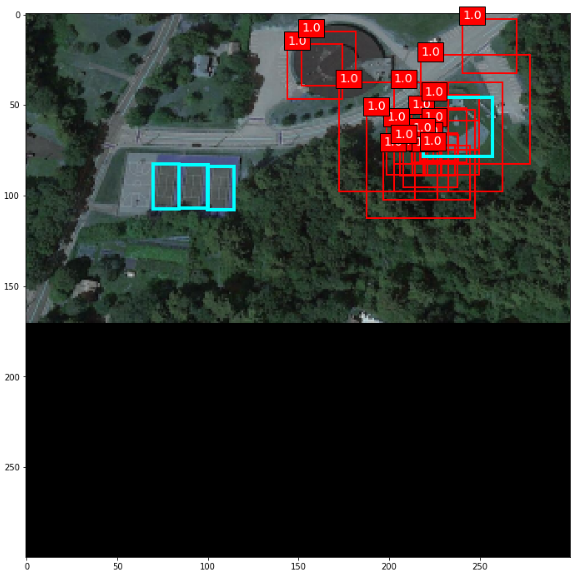

### :dart: Design and implement a network similar to SSD architecture

#### steps are as below:

######      Step 1: Read data

######      step 2: Augmentation

######      Step 3: design model

######      step 4: Design anchor boxes

######      step 5: Set hyperparameters

######      step 6: Prepare labels for ssd network

######      step 7: Deocde ssd out put labels (contain NMS)

######      step 8: Calculate mean average precision(mAP)

######      step 9: train  SSD model

######      step 10: Evaluate SSD model on test data

######      step 11: visualization and result

##### sample of output alog with detections 

